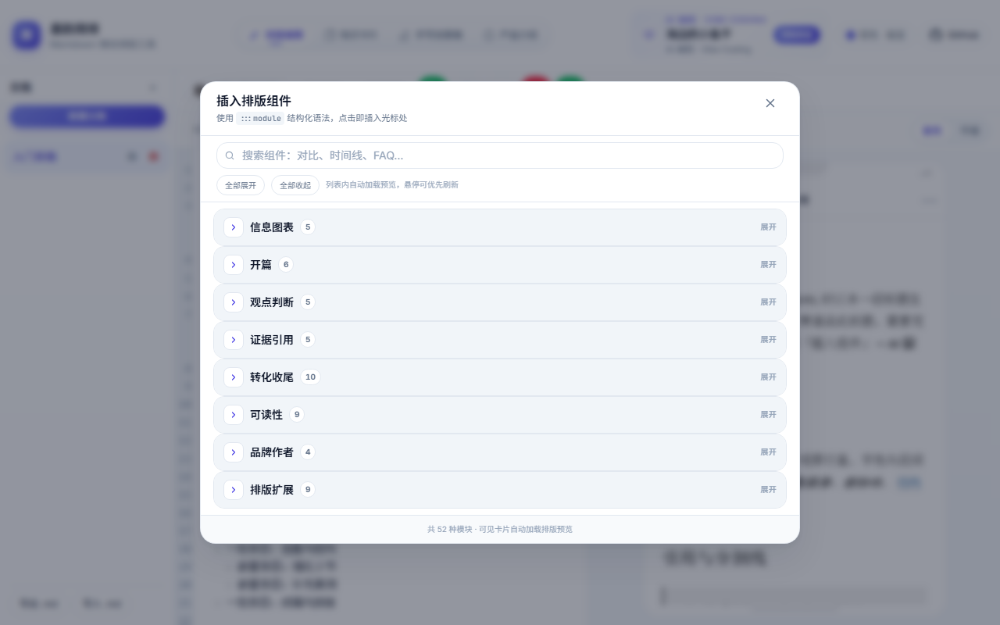

# 墨韵简排

[](LICENSE)
[](https://vuejs.org/)
[](https://vite.dev/)
[](https://www.typescriptlang.org/)
[](https://tailwindcss.com/)
[](https://github.com/DuebassLei/md-wechat-editor)

**写好 Markdown，简排进公众号。**

纯前端的微信公众号排版工作室：在浏览器里写完、预览、复制内联 HTML，粘贴到 [微信公众平台](https://mp.weixin.qq.com) 即可发布。无需登录，文稿留在本地。

**现已上线微信小程序**，手机端也能排版编辑、实时预览与出稿；见下方扫码试用。

---

## 墨韵简排小程序

除 Web 版外，**墨韵简排**已上线微信小程序。在微信里打开即可写作、切换主题、对照预览，适合通勤路上改稿、发布前最后一遍核对。

| 扫码试用 |
|:---:|
|  |
| 微信扫一扫，打开「墨韵简排」小程序 |

- **与 Web 版同源能力** — Markdown 写作、`:::module` 排版组件、多套主题与手机预览
- **轻量出稿** — 复制公众号 HTML，粘贴到公众平台正文编辑器即可
- **顶栏快捷入口** — 在线版点击「小程序上线啦，扫码体验」或「扫码关注」，可弹出小程序码与公众号二维码

小程序码默认使用 `public/miniprogram_logo.jpg`；部署时可设置 `VITE_MINIPROGRAM_QR_URL` 覆盖。

---

## 功能预览

| 排版工作室 | 插入组件 | 产品介绍 |
|:---:|:---:|:---:|
|  |  |  |

截图位于 `.github/readme/`（可用 Playwright 本地重截更新）。

---

## 适合谁用

| 场景 | 你能得到什么 |
|------|----------------|
| 技术/产品公众号运营 | 用熟悉的 Markdown 写作，输出符合公众号样式的排版 |
| 自媒体创作者 | Hero、时间轴、对比、FAQ 等组件开箱即用，少在编辑器里手工调格式 |
| 团队内容协作 | 本地文档列表，支持导入/导出 `.md`，版本与草稿可自控 |
| 从 AI 写作链路来的作者 | 在墨韵主站生成正文后，用本工具做「最后一公里」排版与出稿 |

---

## 核心能力

- **常用 Markdown** — 标题、列表、表格、任务列表、代码块等写作语法完整支持  
- **`:::module` 排版围栏** — 53 种排版组件（封面、步骤、对比、时间轴、CTA、FAQ 等），点击「插入组件」即可写入光标  
- **多套排版主题** — 39 套主题实时切换，右侧手机框预览，所见即所得  
- **一键复制公众号 HTML** — 经 juice 内联样式，直接粘贴公众平台正文编辑器
- **小红书图导出** — 编辑器内一键生成大字报首图 + 自动分页内容图（1080px 宽 PNG），支持 ZIP 打包或逐张下载，元数据来自 `:::hero` / YAML  
- **微信贴图导出** — 图片消息 3:4（1080×1440）首图 + 自动分页；可选「微信风 / 小红书风」皮肤；高清 PNG 或上传优化 JPEG（≤1MB，对齐 `uploadimg`）  
- **语法手册内置** — 应用内可查全量模块说明，不必翻外部文档  
- **界面配色** — 9 套强调色 + 浅色/深色/跟随系统外观，下拉即换，长时间编辑更舒适  

---

## 知识卡片工作室

路径 **`/cards`**（顶栏「知识卡片」）。

- **Markdown 写卡片** — 标题、列表、引用、代码、表格、任务列表等标准语法
- **14 套内容主题** — 清爽知识、莫兰迪、杂志极简、金句黑金等，含纹理图案与多种封面版式
- **封面大字报首图** — YAML / `:::hero` 元数据生成封面，可开关
- **顶栏装饰** — 彩色 accent 顶栏（随主题变化）
- **智能分页** — 默认自动分页；`---` 或 `:::page` 手动断页；可切换单卡模式
- **导出** — 3:4 / 1:1 高清 PNG，支持 ZIP 打包
- **本地持久化** — 浏览器 localStorage 自动保存

---

## 手写创意稿工作室

路径 **`/handwriting`**（顶栏「手写创意稿」）。

- **11 种纸张** — 横线纸、暖色横线、护眼绿、手账粉、方格纸、米黄方格、作文格、红线笔记、复古信笺、空白纸、牛皮纸，含多种样式变体
- **13 款手写字体** — 霞鹜文楷 / Lite / 臻楷 / Neo / 仿宋 / 马克笔，马善政、龙苍、志芒星、刘建毛草、站酷快乐体、佑字朴、佑字麦
- **错别字模拟** — 文本内 `{错字=>正字}`，预览显示错字效果
- **排版调节** — 字号、字间距、行距、词间距滑块实时预览，设置随 localStorage 保存
- **本地持久化** — 浏览器 localStorage 自动保存，支持一键清空

---

## 五分钟上手

```
1. 打开编辑器 → 输入或粘贴 Markdown
2. 用「插入组件」添加 :::hero、:::steps、:::compare 等模块
3. 切换排版主题 → 对照右侧预览
4. 点击「复制公众号 HTML」
5. 登录微信公众平台 → 正文编辑器粘贴发布
```

文首也可用 YAML frontmatter，保存时会自动转为 `:::hero`：

```markdown
---
badge: GUIDE
title: 文章主标题
subtitle: 一句话说明
chips: 标签1|标签2
---

正文从这里开始……
```

更完整的模块列表与字段说明见 [docs/LAYOUT_SYNTAX.md](docs/LAYOUT_SYNTAX.md)；应用内 **语法手册** 与 **插入组件** 与引擎保持同步。

---

## 排版组件速查

共 **53** 种 `:::module` 围栏，按内容结构分类（与「插入组件」面板一致）：

| 分类 | 模块（`:::id` · 中文名） |
|------|--------------------------|
| 开篇 | `hero` 封面 · `cards` 要点卡片 · `label-title` 标签标题 · `part` 分篇 · `toc` 目录 |
| 判断与观点 | `verdict` 最终判断 · `manifesto` 宣言 · `bridge` 过渡 · `audience-fit` 读者适配 · `myth-fact` 误区澄清 |
| 结构与数据 | `timeline` 时间轴 · `steps` 步骤 · `compare` 对比 · `metrics` 核心数据 · `infographic` 信息图 · `stat-row` 数据条 |
| 证据与配图 | `quote` 引用 · `gallery` 图库 · `image-text` 图文 · `image-compare` 图片对比 · `image-steps` 步骤截图 |
| 转化与收尾 | `cta` 行动号召 · `faq` 常见问题 · `checklist` 清单 · `summary` 总结 · `pricing` 定价 · `cases` 案例 · `notice` 公告 |
| 可读性 | `callout` 提示 · `lead` 导语 · `definition` 术语 · `quote-card` 金句卡 · `comparison-table` 对比表 · `changelog` 更新日志 |
| 品牌与人物 | `author-card` 作者卡 · `people` 人物卡 · `series` 专栏 · `subscribe` 订阅引导 |
| 墨韵扩展 | `p-title` 段落标题 · `reading-path` 阅读路线 · `statement` 金句 · `breaking` 分隔强调 · `case-flow` 案例流程 · `badges` 徽章行 |

**39** 套排版主题（默认、山吹、全栈蓝、凝夜紫、微信格式及 Pro 系列等）在编辑器顶栏切换，与模块独立组合。

---

## 排版语法一览

本工具只使用 **常用 Markdown** + **`:::名称` 围栏**，不依赖第三方 R-Markdown 或 XML 标签。

```markdown
:::hero
eyebrow: GUIDE
title: 主标题
subtitle: 副标题
chips: 标签1|标签2
:::

:::steps label="流程" title="三步出稿" active="2"
撰写 | 写 Markdown
预览 | 切换主题对照
发布 | 复制 HTML 粘贴公众号
:::

:::compare 方案 A | 方案 B
✘ 手工排版慢 | 每次调格式费时
✔ 模块语法 | 结构清晰、样式统一
:::
```

闭合行必须是单独的 `:::`。检测到旧版 XML 标签时，编辑器会提示并可尝试自动转换。

---

## 与墨韵 AI 写作平台

| | 墨韵简排（本仓库） | 墨韵主站写作链路 |
|--|-------------------|------------------|
| 定位 | 排版工作室 | 选题、生成、润色 |
| AI 写作 | 不含 | 含 |
| 账号 / 积分 / 云同步 | 不含 | 含 |
| 数据 | 浏览器本地 | 平台侧 |

本工具专注「从 Markdown 到可粘贴的公众号 HTML」；若需要 AI 选题与正文生成，请使用墨韵主站，再导入本工具排版。

---

## 在线体验与源码

- **墨韵简排小程序** — 见上文 [扫码试用](#墨韵简排小程序)（`.github/readme/readme-miniprogram-qr.jpg`）
- **GitHub Pages**（推送 `main` 后自动部署）：`https://<user>.github.io/md-wechat-editor/`  
- **源码仓库**：<https://github.com/DuebassLei/md-wechat-editor>  

本地一键启动：

```bash
npm install
npm run dev
```

---

## 开发者

| 命令 | 说明 |
|------|------|
| `npm run dev` | 本地开发 |
| `npm run build` | 生产构建 |
| `npm run preview` | 预览构建产物 |
| `npm run test:engine` | 排版引擎冒烟测试 |
| `npm run test:card-studio` | 知识卡片工作室引擎冒烟测试 |
| `npm run test:wechat-tietu` | 微信贴图导出冒烟测试 |
| `npm run bench:picker` | 单模块预览渲染 P95 基准（开发） |
| `npm run gen:module-thumbs` | 生成「插入组件」静态缩略图 PNG |
| `npm run lint` | ESLint |

**组件缩略图**：修改排版模块或 `normal` 主题预览样式后，递增 `src/engine/constants/layoutModules.ts` 中的 `LAYOUT_MODULE_THUMB_VERSION`，然后执行 `npx playwright install chromium`（首次）与 `npm run gen:module-thumbs`。

**弹层性能探针**（开发）：控制台执行 `localStorage.setItem('mdwe:picker-perf','1')` 后打开「插入组件」，用 `__pickerPerfReport()` 查看打开/首图耗时。

**技术栈**：Vue 3 · Vite · Tailwind · CodeMirror 6 · marked · juice  

**引擎**：`src/engine/` 独立维护 Markdown → 微信 HTML 管线；模块扩展见 [docs/MODULE_PLUGINS.md](docs/MODULE_PLUGINS.md)。

**GitHub Pages 子路径本地模拟**（PowerShell）：

```powershell
$env:GITHUB_ACTIONS='true'; $env:GITHUB_REPOSITORY='user/md-wechat-editor'; npm run build; npm run preview
```

在仓库 **Settings → Pages → Build and deployment** 中将 Source 设为 **GitHub Actions**，由 `.github/workflows/deploy-pages.yml` 自动发布。

| 环境变量 | 说明 |
|----------|------|
| `VITE_GITHUB_REPO_URL` | 落地页 GitHub 链接，默认 `https://github.com/DuebassLei/md-wechat-editor` |
| `VITE_WECHAT_MP_NAME` | 顶栏公众号推广名称，默认 `墨韵简排` |
| `VITE_WECHAT_MP_HINT` | 推广副文案，默认 `排版技巧 · 更新通知` |
| `VITE_WECHAT_MP_URL` | 弹窗内「在浏览器中打开」链接（可选） |
| `VITE_WECHAT_MP_QR_URL` | 默认公众号二维码图片 URL |
| `VITE_WECHAT_MP_PROMO_ENABLED` | 设为 `false` 关闭顶栏推广位 |
| `VITE_MINIPROGRAM_NAME` | 弹窗内小程序名称展示，默认与 `VITE_WECHAT_MP_NAME` 一致 |
| `VITE_MINIPROGRAM_QR_URL` | 小程序码图片 URL，默认 `public/miniprogram_logo.jpg` |
| `VITE_MINIPROGRAM_BANNER_ENABLED` | 设为 `false` 关闭顶栏「小程序上线」提示 |
| `VITE_MINIPROGRAM_BANNER_TEXT` | 顶栏小程序提示文案，默认 `小程序上线啦，扫码体验` |
| `VITE_XHS_BRAND` | 小红书图导出默认 `@品牌`（未在 hero/YAML 指定时），默认 `墨韵简排` |
| `VITE_WECHAT_TIETU_BRAND` | 微信贴图导出页脚 `@品牌`（未指定时默认同 `VITE_XHS_BRAND`） |

顶栏「扫码关注」点击弹出公众号二维码与小程序码；将图片放到 `public/wechat-mp-qr.png`、`public/miniprogram_logo.jpg`，或分别设置 `VITE_WECHAT_MP_QR_URL`、`VITE_MINIPROGRAM_QR_URL`。

---

## 许可证

本项目采用 **[源代码非商业许可](LICENSE)**（非 MIT / Apache）：

| 允许 | 未经书面同意禁止 |
|------|------------------|
| 个人学习、研究、评测 | 任何商业目的使用 |
| 非商业场景下修改、使用 | 集成到闭源或商业产品 / SaaS |
| Fork 后按**相同协议**开源分发 | 有偿排版服务、白标、OEM、再许可 |

**如需闭源商用授权**，请联系作者：

- **邮箱**：[1130122701@qq.com](mailto:1130122701@qq.com)
- **微信**：公众号「海边的小鱼干」联系「商用授权」

亦可查阅 [COMMERCIAL-LICENSE.md](COMMERCIAL-LICENSE.md)，或通过 [GitHub Issue](https://github.com/DuebassLei/md-wechat-editor/issues/new) 标注 `commercial-license` 联系。

> 说明：GitHub 公开源码不等于可随意商用；商用须另行取得授权。
