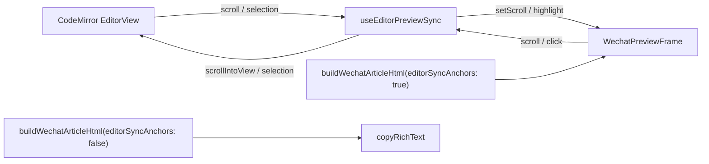

# 编辑器 ↔ 预览双向同步设计

**日期**：2026-06-03  
**状态**：已评审（对话确认）  
**范围**：Studio 工作区（`EditorWorkspace`）左侧 CodeMirror 与右侧微信预览

## 背景与问题

当前左右分栏仅有独立滚动，无位置关联。用户在左侧编辑或滚动时，右侧预览不会跟随到对应内容；也无法通过点击预览快速定位源文。

## 目标

实现 **双向定位（C）**：

| 能力 | 桌面（`lg+` 并排） | 移动（Tab 切换） |
|------|-------------------|------------------|
| 编辑区滚动 → 预览滚动 | ✅ | ❌（预览 pane 不可见时不驱动） |
| 预览滚动 → 编辑区滚动 | ✅ | ❌ |
| 光标移动 → 预览滚动 + 高亮 | ✅ | ✅（仅当预览可见时滚动；否则待切 Tab 后对齐可选一次性） |
| 点击预览 → 编辑区定位 | ✅ | ✅，并切换到「编辑」Tab |

**预览模式**：套壳（`.wechat-shell__scroll`）与平铺（`.preview-root`）均支持。  
**高亮**：当前对应块显示 `outline` 高亮（`.preview-sync-active`）。  
**预览滚动带动编辑区**：桌面启用（用户明确要求）。

**复制公众号 HTML（硬约束）**：「复制公众号 HTML」产出的富文本/HTML **不得**包含同步用属性或类名，与本期改动前粘贴到微信公众平台的行为一致（无 `data-md-line-start`、`data-md-sync`、`.preview-sync-active` 等）。

## 非目标（本期）

- 跨多块选区的范围高亮
- 用户设置项关闭同步
- Playwright E2E（后续按需）

## 方案选择

采用 **方案 3：渲染管线注入源行号 + 块锚点滚动**（拒绝纯滚动比例与仅客户端块序号映射）。

理由：富排版 `:::` 模块导致源文与 DOM 高度非线性；源行号锚点可同时支撑滚动、点击与高亮。

## 架构



**预览与复制分流**：同一套渲染函数，通过 `ArticleRenderOptions.editorSyncAnchors` 控制是否在 HTML 中写入同步属性。预览走 `true`，复制走 `false`（默认）。

### 边界

- **预览 loading**（`usePreviewHtml` 约 280ms 防抖）：暂停同步；`html` 落地后 `nextTick` 重建锚点并按当前光标一次性对齐。
- **防循环**：`syncing: 'editor' | 'preview' | null`，programmatic 滚动期间忽略对侧 listener，下一帧清除。
- **滚动根**：由 `deviceShell` 决定——套壳用 `.wechat-shell__scroll`，平铺用 `.preview-root`。

### 预期改动文件

| 文件 | 职责 |
|------|------|
| `src/composables/useEditorPreviewSync.ts` | 锚点表、滚动/选区/点击、防循环、节流 |
| `src/components/EditorWorkspace.vue` | 串联 editor、preview、breakpoint |
| `src/components/WechatPreviewFrame.vue` | 根 ref、高亮样式、点击委托挂载点 |
| `src/components/MarkdownEditor.vue` | 暴露 `editorView`（已有，确保稳定） |
| `src/engine/render/wechatArticleHtml.ts` | `editorSyncAnchors` 选项；复制默认不标注 |
| `src/engine/...` | `editorSyncAnchors === true` 时输出 `data-md-line-start` / `data-md-sync` |
| `src/composables/usePreviewHtml.ts` | 调用时传 `editorSyncAnchors: true` |
| `src/components/EditorWorkspace.vue` | `copyHtml` 不传或显式 `false`；禁止复用预览用 html 字符串 |
| `src/engine/render/stripEditorSyncAttributes.ts`（可选兜底） | 复制前 strip，防回归 |
| `scripts/smoke-layout-engine.mjs`（可选） | 预览路径含锚点；复制路径不含 |

## 源位置标注

### 约定

- 行号 **1-based**，与 CodeMirror `doc.lineAt(pos).number` 一致。
- 可同步块携带：
  - `data-md-line-start="<n>"`
  - `data-md-sync="block"`

### 标注范围

**标注**：`h1–h6`、`p`、`pre`、`blockquote`、`ul/ol`（容器级）、`table`、`hr`、富排版模块最外层 `section`、`.awp-gfm-theme` 容器及其内顶层块。

**不标注**：纯装饰 wrapper、列表项内层微信兼容 `<section>`、无源文对应关系的内联装饰。

### 注入路径

| 路径 | 实现 |
|------|------|
| **富排版** `parseMarkdown` | 使用现有行索引 `i`：`::: 模块`、callout 等在根 HTML 写 `data-md-line-start={i+1}`；`gfmBuffer` flush 前记录首行号并写入 `.awp-gfm-theme` 容器 |
| **纯 GFM** `renderMarkdown` | `annotateGfmBlocks(markdown, html)`：按空行切分源文，对 `#nice` 直接子节点按顺序写入 `data-md-line-start` |
| **aiIndigo 等** | hero/toc 等 section 标注对应元信息行；正文段落在生成点标注 |

以上注入**仅在** `editorSyncAnchors === true` 时执行。

### 复制管线隔离

| 调用方 | `editorSyncAnchors` | 说明 |
|--------|---------------------|------|
| `usePreviewHtml` | `true` | 右侧 `v-html` 预览 |
| `EditorWorkspace.copyHtml` | `false`（默认） | 每次独立 `buildWechatArticleHtml`，**不得**使用 `usePreviewHtml` 缓存的 `html` |
| 模块缩略图 / 其它导出 | `false`（默认） | 保持现有行为 |

实现上在 `buildWechatArticleHtml` / `renderMarkdownWithThemeExtras` 将选项传入标注逻辑。可选：复制前对结果调用 `stripEditorSyncAttributes(html)` 作为兜底（移除 `data-md-line-start`、`data-md-sync` 及 `preview-sync-active` 类），便于冒烟断言复制路径无残留。

`.preview-sync-active` 仅由 composable 在**已挂载的预览 DOM** 上切换，不会出现在复制字符串中。

## 同步算法

### 锚点表

预览 `html` 更新且 `loading === false` 后，在当前滚动根内：

```text
anchors = queryAll('[data-md-sync="block"]')
  .map(el => ({ line: +dataset.mdLineStart, el, top: offsetTop相对scrollRoot }))
  .sort(by line)
```

`deviceShell` 切换后 `nextTick` 重算 `top`。

### 映射规则

| 触发 | 行为 |
|------|------|
| 编辑区滚动 | `centerLine` = 视口垂直中心行 → `anchor = max{a \| a.line ≤ centerLine}` → 设置预览 `scrollTop` 使 `anchor.el` 居中 |
| 预览滚动 | 视口中心最近 `anchor.el` → `EditorView.scrollIntoView({ line, y: 'center' })` |
| 光标/选区 | `cursorLine` → 同找 anchor → 预览滚动 + `.preview-sync-active` |
| 预览点击 | `closest('[data-md-line-start]')` → 设置 selection + `scrollIntoView`；`<lg` 调用 `onRequestEditTab()` |

**节流**：滚动 `requestAnimationFrame` 合并；选区 `debounce 50ms`。

**冲突**：同行多锚点时，滚动取 **DOM 更浅** 的块；点击由 `closest` 自然解析。

**间隙**：`cursorLine` 无精确匹配时取 `max{a.line ≤ cursorLine}`，否则取首个锚点。

### 高亮

```css
[data-md-sync].preview-sync-active {
  outline: 2px solid rgb(var(--color-jade) / 0.55);
  outline-offset: 2px;
  border-radius: 4px;
  transition: outline-color 0.15s ease;
}
```

滚动与光标共用同一 active 锚点，避免两套状态。

## Composable API

### `useEditorPreviewSync(options)`

| 入参 | 说明 |
|------|------|
| `editorView` | `Ref<EditorView \| null>` |
| `previewRoot` | `Ref<HTMLElement \| null>` |
| `getScrollRoot` | 返回当前模式滚动容器 |
| `previewLoading` | `Ref<boolean>` |
| `previewHtml` | `Ref<string>`，变化重建锚点 |
| `sideBySide` | `Ref<boolean>`，`matchMedia('(min-width: 1024px)')`；为 false 时不绑双向滚动 listener |
| `onRequestEditTab` | 移动点击预览后 `mobileTab = 'edit'` |

## 边界与降级

| 情况 | 行为 |
|------|------|
| 空文档 / 无锚点 | 早退，不绑 listener |
| 锚点为空但文档非空 | `console.warn` 一次（dev） |
| 预览 loading | 内部 `paused`，不滚动 |
| 快速输入 | 防抖期间冻结预览侧滚动同步；html 更新后按光标一次性对齐 |

## 测试

### 单元

纯函数：`buildAnchorTable`、`lineToAnchor`、`anchorAtPreviewCenter`（jsdom + fixture HTML）。

### 引擎冒烟（建议）

- `editorSyncAnchors: true`：GFM 段落、`::: engage` 含 `data-md-line-start`。
- `editorSyncAnchors: false`（默认）：同输入**不得**含 `data-md-line-start` / `data-md-sync`（与复制一致）。

### 手动验收

**桌面（套壳 + 平铺各测）**

1. 编辑滚动 → 预览对齐 + 高亮  
2. 预览滚动 → 编辑对齐  
3. 光标移动 → 预览跟随 + 高亮  
4. 点击预览 → 光标与视口正确  
5. 快速输入 → 更新后高亮不长期错位（≤300ms 可接受）  
6. 切换主题/预览模式 → 同步正常、无循环报错  

**移动**

7. 预览 Tab 点击 → 切编辑 Tab + 定位  
8. 仅编辑 Tab 滚动 → 不要求预览 Tab 滚动位置变化  

**复制**

9. 点击「复制公众号 HTML」后粘贴到纯文本/编辑器，HTML 中无 `data-md-line-start`、`data-md-sync`。  
10. 与本期前同篇文稿对比，复制结果无新增属性（可对同一 `markdown` 做快照或冒烟 diff）。

## 实现顺序建议

1. `ArticleRenderOptions.editorSyncAnchors` + 复制路径默认关闭  
2. 引擎：条件注入 `data-md-line-start`（富排版 + GFM）  
3. `usePreviewHtml` 开启 `editorSyncAnchors`；确认 `copyHtml` 独立构建且为 `false`  
4. `WechatPreviewFrame` 高亮样式 + ref  
5. `useEditorPreviewSync` 锚点表 + 点击/光标  
6. 桌面双向滚动 + 防循环  
7. 移动 Tab 切换 + `sideBySide` 门控  
8. 冒烟：预览有锚点、复制无锚点  
